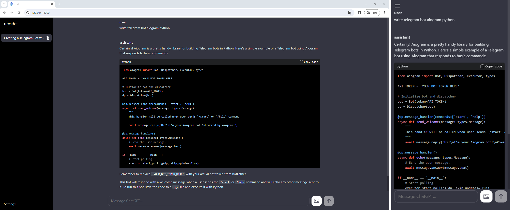

# ChatGPTJet

**ChatGPTJet**  is a shell for [gpt4free](https://github.com/xtekky/gpt4free)

Some features:
- generating a title for a conversation
- tracking the g4f library version
- adapted for mobile devices
- ability to set a password
- TeX math support
- code highlighting
- image upload from Bing and Gemini providers

## Usage
`start-postgresql.bat` or `start-qlite.bat` creates a virtual environment and installs the necessary dependencies. `start-qlite.bat` creates a local database with the necessary tables if necessary (the `sql_commands.sql` file contains the necessary sql commands to create the necessary tables and fields).

Environment variables:
- `DB_URL_POSTGRESQL` - url for your postgres database
- `DB_URL_SQLITE` - url for your sqlite database
- `PASSWORD` - login password (optional)